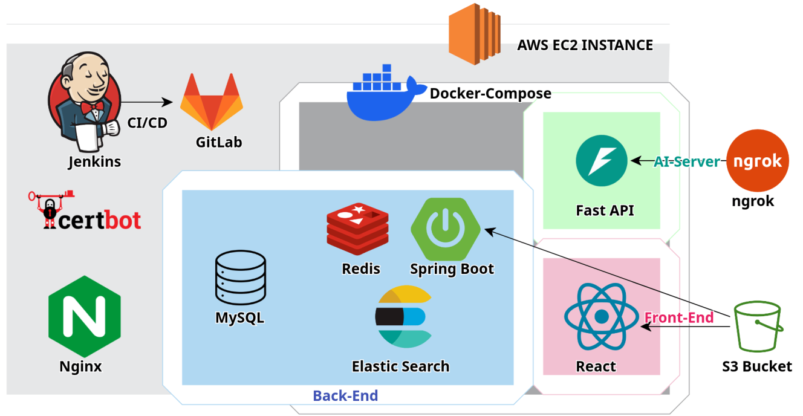
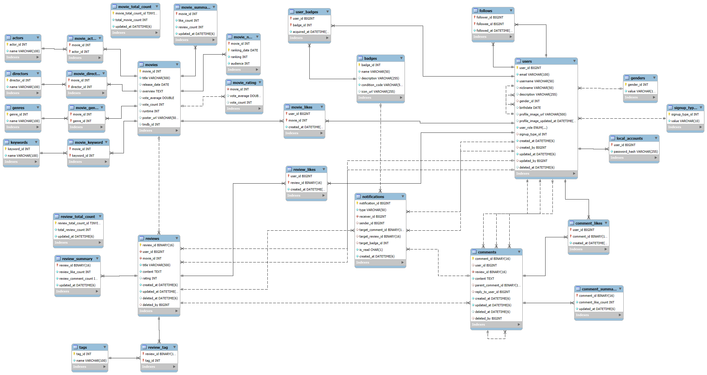

## **🎬 FeelRoom: 영화 리뷰 SNS**

소통을 통해 인생영화를 찾는,
영화 리뷰 소통 및 AI 리뷰 + 영화 추천 SNS 서비스 입니다.


## ✨ 주요 기능
- **소셜 피드**: 팔로잉하고 있는 다른 사용자들의 리뷰를 탐색하고 댓글/대댓글, 좋아요 등으로 소통할 수 있습니다.
<table>
  <tr>
    <td align="center">
      
    </td>
    <td align="center">
      
    </td>
  </tr>
</table>
<br>

- **추천 & 인기 피드**: 사용자의 활동 기록을 바탕으로 다른 사용자의 리뷰를 제공하거나 '좋아요','댓글' 수와 시간 감쇠 로직을 반영하여 인기 리뷰 피드를 제공합니다.
<table>
    <tr>
        <td align="center">
            
        </td>
    </tr>
</table>
<br>


- **영화 검색**: 유연한 키워드 검색으로 직관적으로 영화를 검색하고 탐색할 수 있습니다.
<table>
    <tr>
        <td align="center">
            
        </td>
    </tr>
</table>
<br>


- **AI추천태그**: 영화 제목과 리뷰 작성 내용을 기반으로 작성된 리뷰를 잘 드러낼 수 있는 해시태그를 추천합니다.
<table>
    <tr>
        <td align="center">
            
        </td>
    </tr>
</table>

- **영화 추천 서비스**: 사용자의 활동 내역을 기반으로 AI가 분석하여, 사용자가 좋아할 만한 영화를 추천합니다.
<table>
  <tr>
    <td align="center">
      
    </td>
    <td align="center">
      
    </td>
  </tr>
</table>
<br>

- **프로필**: 내가 작성한 리뷰, 좋아하는 영화, 활동 배지 등을 모아볼 수 있는 개인 공간입니다.
<table>
    <tr>
        <td align="center">
            
        </td>
    </tr>
</table>
<br>

- **뱃지 시스템**: 다양한 활동을 통해 특별한 뱃지를 획득하는 재미를 느낄 수 있습니다.
<table>
    <tr>
        <td align="center">
            
        </td>
    </tr>
</table>

## 🛠️ 기술 스택

| 구분 | 기술 |
| --- | --- |
| **Frontend** | React, Vite, JavaScript, Zustand, Axios |
| **Backend** | Java, Spring Boot, Spring Data JPA, Gradle, MySQL |
| **AI** | Python, FastAPI, Konlpy, Scikit-learn |
| **Database** | MySQL |
| **DevOps** | Docker, Docker Compose, Jenkins, Nginx |

## 📐 시스템 아키텍처


### DB ERD



## 📂 프로젝트 구조

```
S13P11D208/
├── ai/                # FastAPI 기반 AI 모델 서버
├── backend/           # Spring Boot 백엔드 API 서버
├── frontend/          # React 프론트엔드 애플리케이션
├── exec/              # SQL 덤프 및 프로젝트 문서
├── readme/            # Readme 폴더
├── .env               # 전체 서비스 환경변수
├── docker-compose.yml # 서비스 실행을 위한 Docker Compose 설정
└── README.md          # 프로젝트 소개
```

